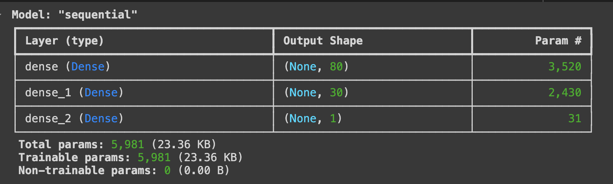

# Alphabet Soup: Deep Learning Model for Funding Success Prediction

## Overview of the Analysis

Alphabet Soup is a nonprofit organization seeking to predict which applicants for their funding are most likely to succeed based on historical data. The goal of this project is to build a **binary classification model** using deep learning to help Alphabet Soup make informed decisions about which applicants to fund. Using various features of past applicants, the model is designed to predict the success of future applicants.

---

## Data Preprocessing

### Target Variable

- The target variable is `IS_SUCCESSFUL`, indicating whether the funding was used successfully by the applicant.

### Feature Variables

- The features used for the model include:
  - `APPLICATION_TYPE`
  - `CLASSIFICATION`
  - `ASK_AMT`
  - `AFFILIATION`
  - `USE_CASE`
  - `ORGANIZATION`
  - `STATUS`
  - `INCOME_AMT`
  - `SPECIAL_CONSIDERATIONS`

### Removed Variables

- The columns `EIN` and `NAME` were removed from the dataset as they are identifiers that do not contribute to the prediction model.

### Data Transformation

- One-hot encoding was applied to the categorical variables to convert them into numerical format, allowing the neural network to process them.

---

## Compiling, Training, and Evaluating the Model

### Model Architecture

#### Initial Model

The initial model consists of two hidden layers with a total of 5,981 parameters:

#### Optimized Model

The optimized model consists of three hidden layers with a total of 18,051 parameters:

### Model Compilation

- The model was compiled using the **Adam optimizer**, with **binary cross-entropy** as the loss function, given the binary nature of the classification problem.

### Model Performance

- After training for 100 epochs, the initial model achieved the following performance metrics:
  - **Accuracy**: 72.70%
  - **Loss**: 0.5951

---

## Optimizations

Several optimization techniques were implemented to improve the performance of the model:
1. **Increased Neurons**: Additional neurons were added to the hidden layers.
2. **Added Layers**: A third hidden layer was introduced to increase model complexity.

### Optimized Model Performance

- After optimization, the model achieved the following metrics:
  - **Accuracy**: 72.94%
  - **Loss**: 0.5859

Despite the optimizations, the target accuracy of 75% was not reached.

---

## Training Visualizations

### Optimized Model Accuracy over Epochs

### Optimized Model Loss over Epochs

---

## Summary of Results

The deep learning model achieved an accuracy of **72.94%** after optimization, showing slight improvement over the initial version. However, the model fell short of the 75% target accuracy. The applied optimizations (adding neurons and layers) led to improved performance, but further enhancements are needed to achieve the desired accuracy.

### Recommendations

For future work, it is recommended to experiment with alternative models such as:
- **Random Forest Classifier**: Works well with structured/tabular data.
- **XGBoost**: A powerful and efficient model for classification tasks that can outperform deep learning models on tabular data.

These models could potentially yield better results with the given dataset, and fine-tuning hyperparameters with a grid search could further improve predictive performance.
